  

<h3 align="center">M.Sc. Student in Automation & Mechatronics · AI Developer · Tinkerer</h3>
<h4 align="center">Chalmers University of Technology · Gothenburg, Sweden</h4>

  

  
  

 

- M.Sc. in **Automation & Mechatronics** @ Chalmers (graduating 2028)
- Building **agentic AI systems** — MCP gateway, multi-agent orchestration (Claude + Codex + Gemini + Jules + Copilot in parallel)
- Developing **macOS apps** in Swift/SwiftUI — Notch for Everything, ClaudeCodeForXcode (TCA + XPC)
- Experience in **computer vision** — YOLOv11, SAM2, CLIP, synthetic data pipelines for robotic sorting
- B.Sc. thesis: **dual-axis solar tracking** optimization at 57.7°N — Arduino + Python data analysis
- Contributing to **open source** — Message if you are in need of a contributor for your project!
- When not coding: Listen to R&B, soul & jazz music while studying

 

# 🚀 Featured Projects

<table>
  <tr>
    <td width="50%" valign="top">
      <h3>🎵 Notch for Everything</h3>
      
macOS notch-based control hub — Spotify/Apple Music, Samsung TV remote, theme engine, PRD-driven settings.

      
  

    </td>
    <td width="50%" valign="top">
      <h3>🌐 Remote MCP Gateway</h3>
      
Cloudflare Workers gateway aggregating 109 tools across 10 MCP servers — remote tool execution for Claude and other AI agents.

      
 

    </td>
  </tr>
  <tr>
    <td width="50%" valign="top">
      <h3>🧠 ClaudeCodeForXcode</h3>
      
Claude Code as an Xcode extension for Intel Macs — TCA architecture, XPC services, PTY sessions, embedded system prompt, MCP tools, and OAuth via claude.ai.

      
 

    </td>
    <td width="50%" valign="top">
      <h3>🔬 code-brain MCP Server</h3>
      
Local code indexing with hybrid search — SQLite + sqlite-vec + FTS5, tree-sitter AST chunking, and Gemini/Ollama embeddings. Built as a Python MCP tool.

      
 

    </td>
  </tr>
  <tr>
    <td width="50%" valign="top">
      <h3>🤖 Multi-Agent Orchestration</h3>
      
Running Claude, Gemini, Codex, Jules, and Copilot SWE Agent in parallel on the same codebase. Amplify framework benchmarking (v4–v8), hive-mind spawning, and systematic 6-round audits.

      
 

    </td>
    <td width="50%" valign="top">
      <h3>👕 Annotation Pipeline</h3>
      
Production ML system for robotic annotation sorting — YOLOv11, SAM2, CLIP, Ollama. Automated annotation via Claude Vision API + Playwright/Claude Extension + Label Studio.

      
 

    </td>
  </tr>
</table>

 

# 🛠️ Tech Stack

<table>
  <tr>
    <td align="center" width="96">
      
       Python
    </td>
    <td align="center" width="96">
      
       Swift
    </td>
    <td align="center" width="96">
      
       TypeScript
    </td>
    <td align="center" width="96">
      
       JavaScript
    </td>
    <td align="center" width="96">
      
       C++
    </td>
    <td align="center" width="96">
      
       Bash
    </td>
    <td align="center" width="96">
      
       LaTeX
    </td>
  </tr>
  <tr>
    <td align="center" width="96">
      
       PyTorch
    </td>
    <td align="center" width="96">
      
       TensorFlow
    </td>
    <td align="center" width="96">
      
       OpenCV
    </td>
    <td align="center" width="96">
      
       Docker
    </td>
    <td align="center" width="96">
      
       Cloudflare
    </td>
    <td align="center" width="96">
      
       SQLite
    </td>
    <td align="center" width="96">
      
       PostgreSQL
    </td>
  </tr>
  <tr>
    <td align="center" width="96">
      
       Git
    </td>
    <td align="center" width="96">
      
       GitHub
    </td>
    <td align="center" width="96">
      
       VS Code
    </td>
    <td align="center" width="96">
      
       Arduino
    </td>
    <td align="center" width="96">
      
       MATLAB
    </td>
    <td align="center" width="96">
      
       Claude API
    </td>
    <td align="center" width="96">
      
       MCP
    </td>
  </tr>
</table>

 

## 📊 GitHub Stats

  
  

  

  

 

## 🏆 GitHub Trophies

  

 

<!-- Snake animation — uncomment after adding a PAT with read:user scope as GH_TOKEN secret

  

-->

 

## 🎵 Now Playing

> *"Whatever Smart-Shuffle picks for me"*

 

---

  

  <i>Based in Gothenburg · Open to collaborate and help wherever I'm needed</i>

